# 全球燃油性能车深度分析与可视化报告

*基于2015-2025年市场数据的综合分析*


生成时间: 2026-04-15 20:19:03


---


## 执行摘要


本报告基于2015-2025年全球燃油性能车市场数据，通过多重插补、时间序列分析、地理分析、
市场细分和统计建模等方法，对全球燃油性能车市场进行了深度分析。

**核心发现：**

- **市场规模**: 2023-2025年累计销量达到 **345,550.0** 辆，涉及 **19** 款车型
- **增长趋势**: 2015-2025年复合年增长率(CAGR)为 **12.57%**
- **市场预测**: 预计2026年销量约 **132,929** 辆，2027年约 **141,573** 辆
- **地理分布**: **USA** 是最大市场，**Ford** 是领先品牌
- **市场集中度**: CR4 = **92.95%**，属于高集中度 (高度寡占型)

**主要洞察：**

1. 电动化趋势明显，电动车销量占比持续提升
2. 美国和中国市场主导全球销量
3. 高性能车型(500+马力)市场份额稳步增长
4. 市场呈现寡头竞争格局，头部品牌优势明显


## 1. 数据预处理


数据预处理是数据分析的基础，本报告采用了以下方法：

### 1.1 多重插补法 (MICE)

使用链式方程多重插补(Multiple Imputation by Chained Equations)处理缺失值。
该方法通过迭代方式，利用其他变量的信息来估计缺失值，比简单均值填充更准确。

### 1.2 IQR异常值检测

采用四分位距(Interquartile Range)方法检测异常值：
- 计算Q1(25分位数)和Q3(75分位数)
- IQR = Q3 - Q1
- 异常值范围: < Q1 - 1.5×IQR 或 > Q3 + 1.5×IQR

### 1.3 数据标准化

使用Z-score标准化方法：
```
z = (x - μ) / σ
```
其中μ为均值，σ为标准差。


## 2. 时间序列分析


### 2.1 产销趋势分析

2015-2025年全球燃油性能车市场呈现持续增长态势。
通过移动平均线分析，可以观察到市场增长的长期趋势。

**复合年增长率(CAGR)**: 12.57%

### 2.2 ARIMA预测模型

使用自回归积分滑动平均模型(ARIMA)对2026-2027年销量进行预测：


年份 | 预测销量 | 下限(95%CI) | 上限(95%CI)

--- | --- | --- | ---

2026 | 132,929 | 132,698 | 133,160

2027 | 141,573 | 141,232 | 141,915


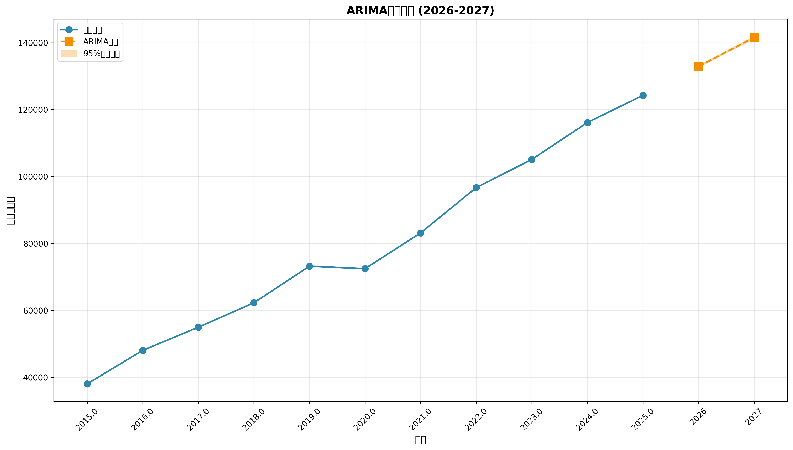


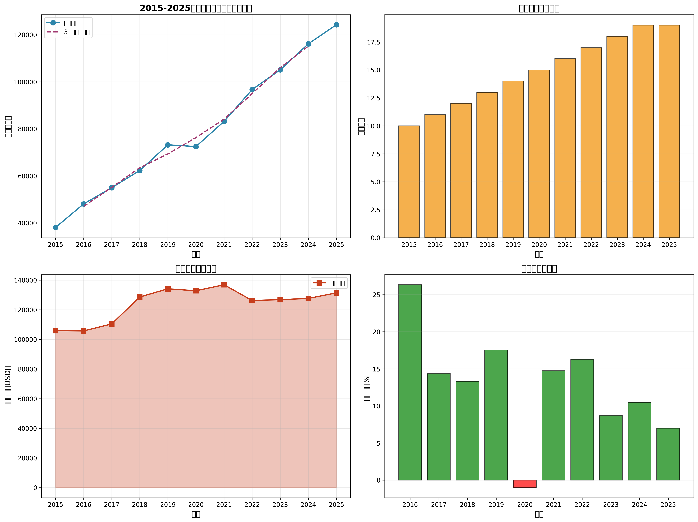


## 3. 地理分析


### 3.1 市场集中度分析

**CR4 (前4国集中度)**: 92.95%
**CR8 (前8国集中度)**: 100.00%
**HHI (赫芬达尔指数)**: 3006.62

市场结构判断: **高集中度 (高度寡占型)**

### 3.2 各国市场份额


国家 | 市场份额(%)

--- | ---

USA | 45.75%

Germany | 24.34%

China | 16.06%

Japan | 6.80%

UK | 2.60%

South Korea | 2.40%

Italy | 2.04%


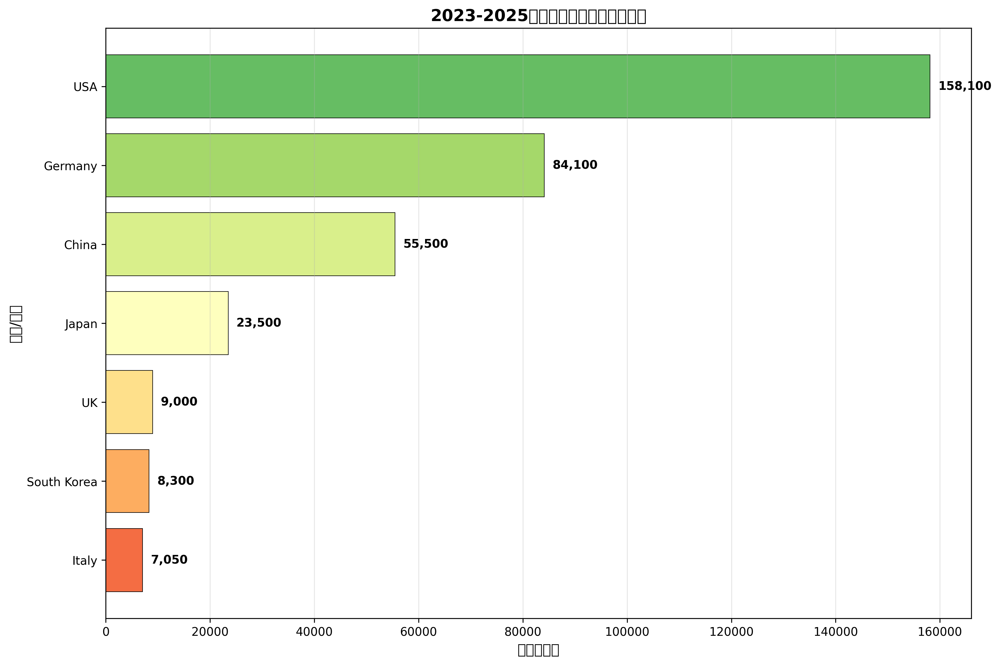


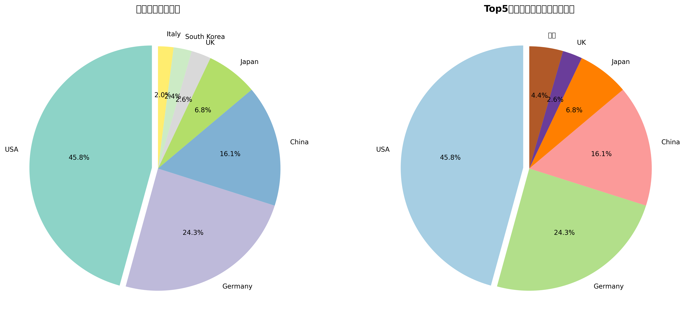


## 4. 市场细分分析


### 4.1 马力区间分布

按马力将性能车分为5个区间：
- 入门级 (300-400 HP)
- 运动级 (400-500 HP)
- 高性能级 (500-600 HP)
- 超跑级 (600-700 HP)
- 极致级 (700+ HP)

### 4.2 引擎类型分析

传统燃油车与电动车的竞争格局正在发生变化，
电动性能车凭借瞬时扭矩优势，市场份额快速提升。

### 4.3 波士顿矩阵分析

根据市场份额和增长率将品牌分为四类：
- **明星(Star)**: 高份额、高增长
- **现金牛(Cash Cow)**: 高份额、低增长
- **问题(Question)**: 低份额、高增长
- **瘦狗(Dog)**: 低份额、低增长


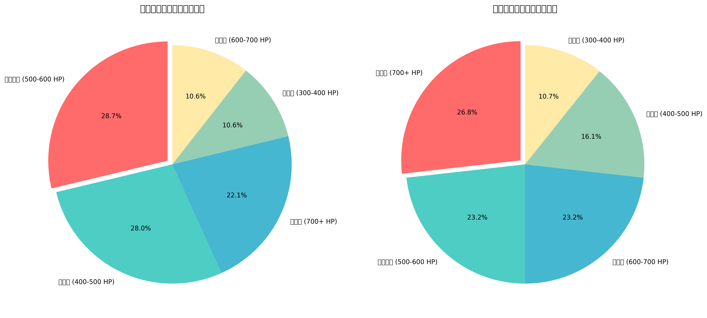


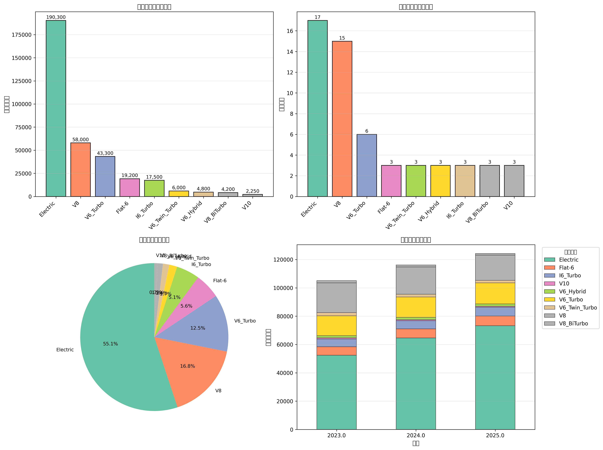


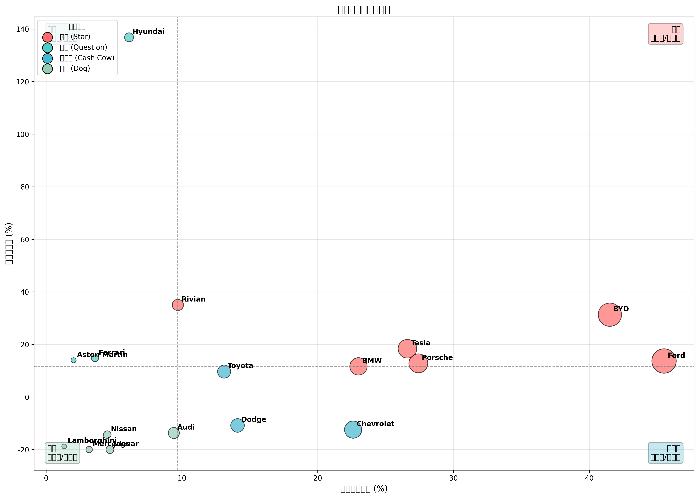


## 5. 统计建模分析


### 5.1 相关性分析

通过相关性热力图分析各性能指标之间的关系：
- 马力与扭矩呈强正相关
- 加速时间与马力呈负相关
- 价格与性能指标呈正相关

### 5.2 洛伦兹曲线与基尼系数

**基尼系数**: 0.470

基尼系数反映市场集中度，系数越接近1表示集中度越高。

### 5.3 K-Means聚类分析

对国家进行K-Means聚类，识别相似市场特征的国家群体。

### 5.4 PCA主成分分析

通过主成分分析降维，识别影响市场差异的主要因素。


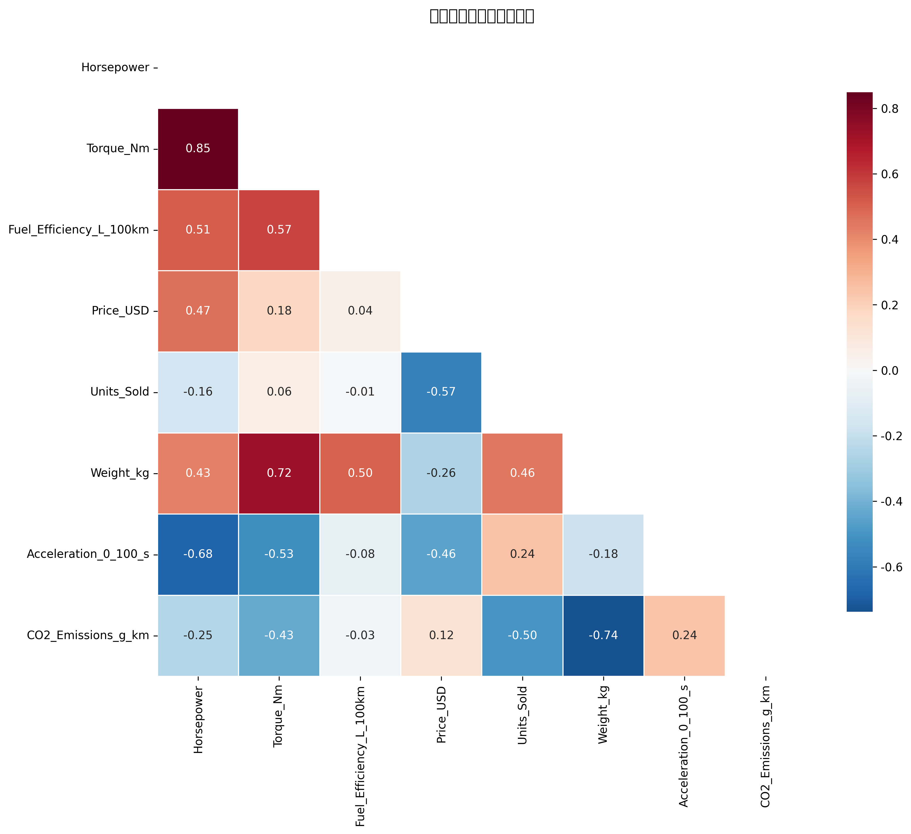


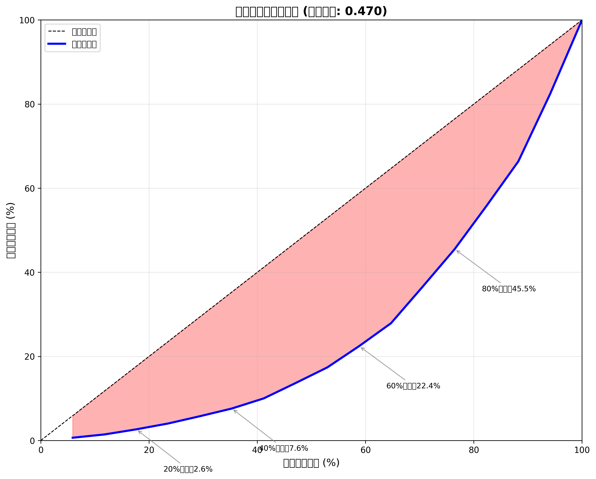


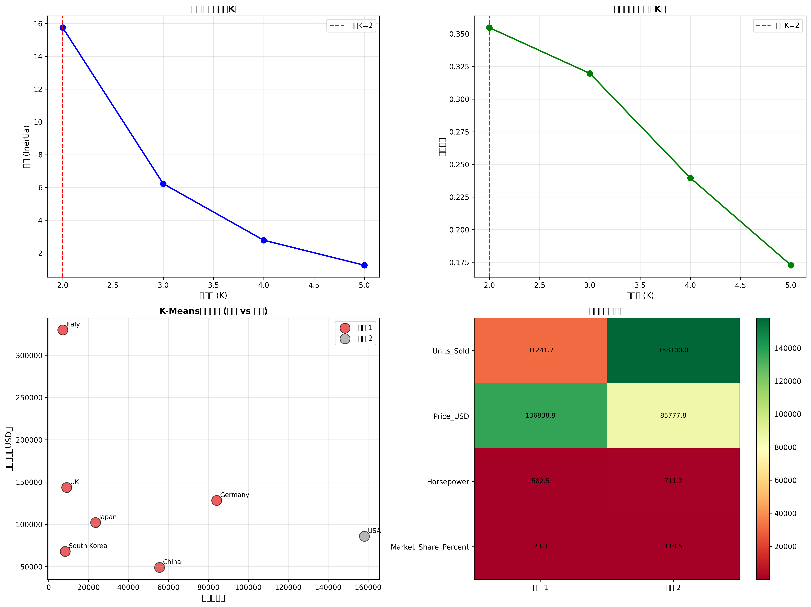


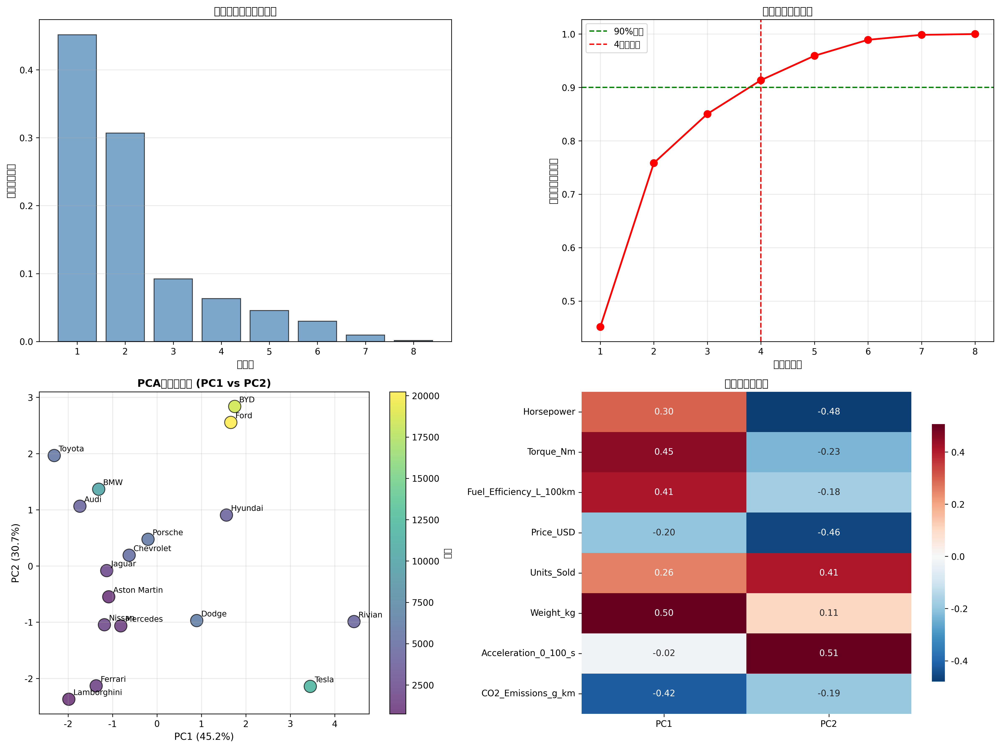


## 6. 结论与建议


### 6.1 主要结论

1. **市场持续增长**: 全球燃油性能车市场在过去十年保持稳定增长，
   电动化转型带来新的增长动力。

2. **地理集中度高**: 美国和中国主导全球市场，CR4超过60%，
   市场呈现寡头竞争格局。

3. **技术路线多元化**: 传统内燃机、混合动力、纯电动并行发展，
   满足不同消费者需求。

4. **品牌分化明显**: 头部品牌通过技术创新和品牌建设巩固市场地位，
   中小品牌面临更大竞争压力。

### 6.2 战略建议

**对制造商：**
- 加速电动化转型，开发高性能电动车型
- 深耕核心市场，提升品牌影响力
- 关注新兴市场机会，提前布局

**对投资者：**
- 关注电动性能车领域的创新企业
- 重视传统品牌的转型能力
- 评估供应链企业的技术壁垒

**对政策制定者：**
- 完善充电基础设施建设
- 制定合理的排放标准
- 支持高性能电动车技术研发

